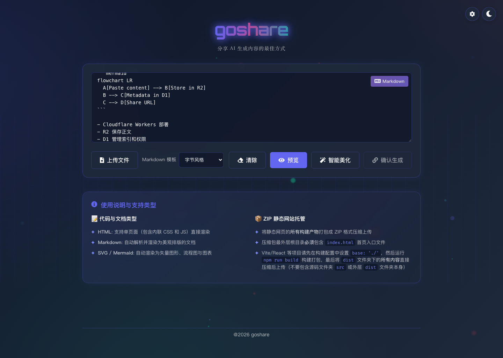
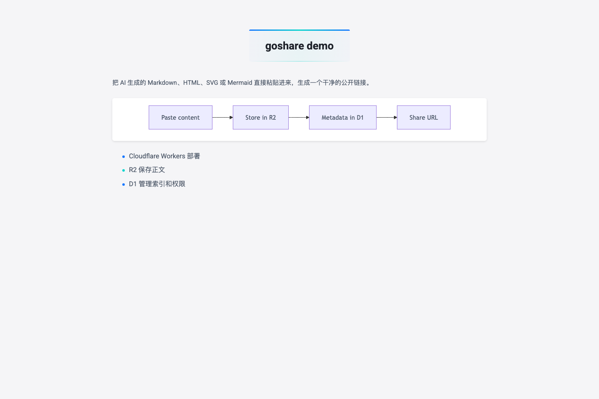
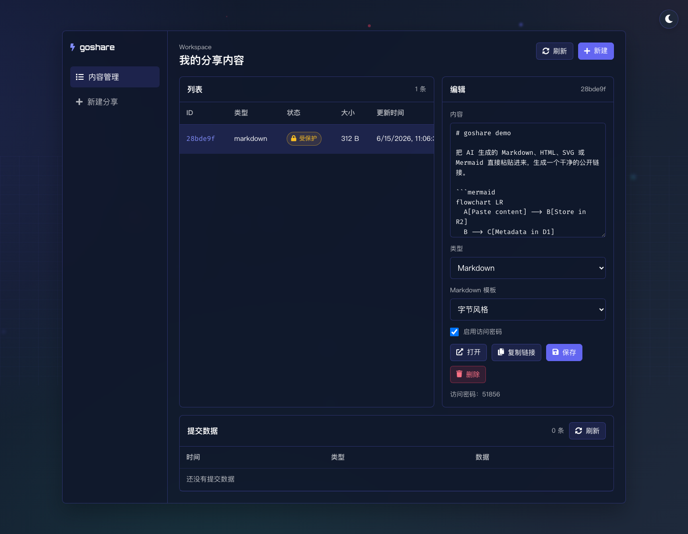
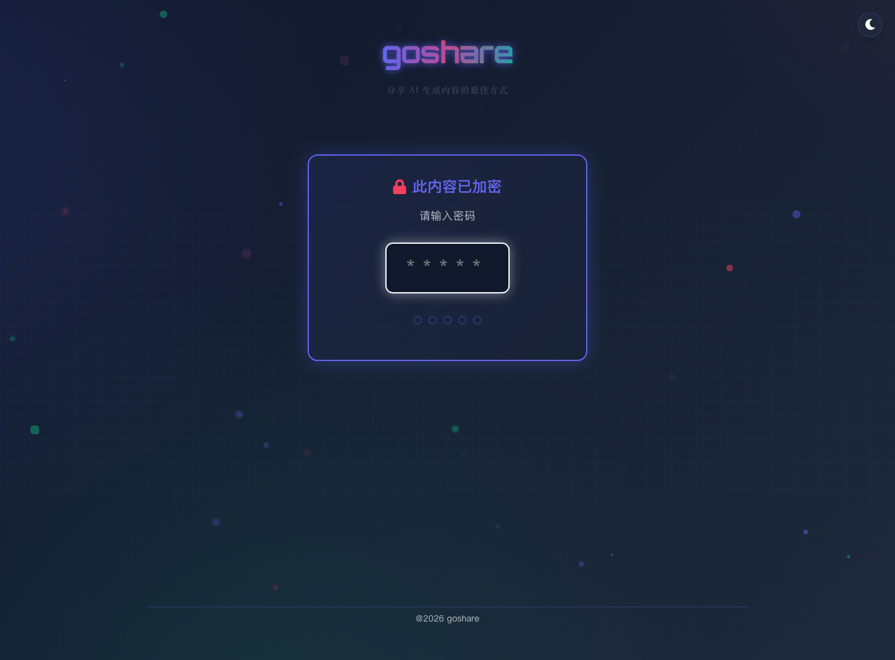
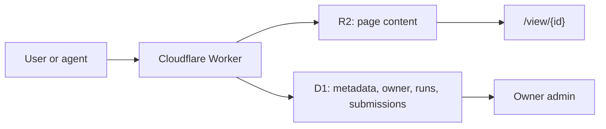

<p align="center">
  
</p>

<h1 align="center">goshare</h1>

<p align="center">
  <strong>把 AI 生成内容变成可拥有、可分享、可自动化的链接。</strong><br>
  Paste HTML, Markdown, SVG, Mermaid, or static ZIP output, then share it from your own Cloudflare stack.
</p>

<p align="center">
  <a href="https://deploy.workers.cloudflare.com/?url=https://github.com/HaipingShi/goshare">
    
  </a>
</p>

<p align="center">
  <a href="#用-ai-agent-部署"><strong>AI Agent 部署 Prompt</strong></a>
  ·
  <a href="#agent-api"><strong>Agent API</strong></a>
  ·
  <a href="#本地开发"><strong>本地开发</strong></a>
  ·
  <a href="#english"><strong>English</strong></a>
</p>

[](https://github.com/HaipingShi/goshare/stargazers)
[](https://github.com/HaipingShi/goshare/forks)
[](https://github.com/HaipingShi/goshare/issues)
[](#license)



## 这是什么

你让 AI 写了一个 HTML demo、一段 Markdown 文档、一个 SVG 图标、一个 Mermaid 图，或者一个静态网页 ZIP。

goshare 做一件事：把这些内容放进你自己的 Cloudflare R2/D1/Workers，生成一个干净的 `/view/<id>` 链接。你拥有数据，也拥有部署。

## 为什么用

- **AI 输出立刻可交付**：不用让内容困在聊天窗口或本地文件里。
- **数据归你**：正文进 R2，索引、权限和提交数据进 D1。
- **人和 Agent 都能创建**：网页粘贴生成，或用 Bearer Token 调 Agent API。
- **Markdown 好看**：内置字节风格、GitHub、技术文档三种模板。
- **适合自部署传播**：Deploy Button、`/bootstrap` 和部署 prompt 都已准备好。

## 一键部署

点击顶部 **Deploy to Cloudflare**，Cloudflare 会读取 `wrangler.jsonc` 并绑定：

- Worker：`src/worker.js`
- Static Assets：`public/`
- D1：`DB`
- R2：`CONTENT_BUCKET`
- Workers AI：`AI`

部署后建议立刻在 Cloudflare Worker 的 Variables/Secrets 设置：

```txt
AUTH_ENABLED=true
AUTH_PASSWORD=<your-strong-password>
COOKIE_SECRET=<openssl rand -hex 32>
AGENT_API_TOKEN=<agent-api-token-for-coding-agents>
APP_LOGO_URL=/icon/web/icon-512.png
PUBLIC_SITE_URL=https://your-share-domain.example
```

## 用 AI Agent 部署

把下面这段话复制给 Codex、Claude Code 或其他 coding agent，让它陪你完成生产部署。

```text
请作为我的 goshare Cloudflare 部署向导，逐步检查并引导我完成生产部署。
源码仓库：https://github.com/HaipingShi/goshare
目标站点域名：<填入你的域名或 workers.dev 地址>

请按顺序确认：
1. Cloudflare Worker、Static Assets、R2 bucket、D1 database 是否已通过 Deploy Button 或 Wrangler 创建并绑定。
2. 远端 D1 migrations 是否已应用，尤其是 agent_runs、agent_run_logs、page_submissions 和 markdown_theme 相关迁移。
3. 生产变量/Secret 是否已设置：AUTH_ENABLED、AUTH_PASSWORD、COOKIE_SECRET、AGENT_API_TOKEN、APP_NAME、APP_LOGO_URL、PUBLIC_SITE_URL。
4. Worker 是否已部署成功，自定义域名是否绑定成功。
5. 用 curl 测试 /api/agent/pages，确认 Bearer Token 能创建 Markdown 分享页并返回 url、urlId、runId、status、logs。
6. 打开 /bootstrap、首页、生成链接、分享页和后台管理页做浏览器冒烟验证。

每一步请先告诉我目的和风险，再给我需要执行的命令或 Cloudflare 控制台操作。
```

## 功能一览

| 能力 | 说明 |
| --- | --- |
| HTML / Markdown / SVG / Mermaid | 自动识别并渲染成可分享页面 |
| 静态 ZIP | 上传构建产物，托管一个轻量静态站 |
| 访问密码 | 给单条分享开启 5 位数字密码 |
| Owner 后台 | 当前浏览器只管理自己创建的页面 |
| 页面提交数据 | 分享页可用 `window.goshare.submit()` 写入 D1 |
| Agent API | coding agent 可直接创建分享页 |

<details>
<summary>查看更多截图</summary>




| 内容管理后台 | 访问密码 |
| --- | --- |
|  |  |

</details>

## Agent API

设置 `AGENT_API_TOKEN` 后，vibe coding agent 可以不经过 UI，直接创建分享页。

```bash
curl -X POST "https://your-share-domain.example/api/agent/pages" \
  -H "Authorization: Bearer $AGENT_API_TOKEN" \
  -H "Content-Type: application/json" \
  -d '{
    "content": "# Hello goshare\n\nCreated by an agent.",
    "codeType": "markdown",
    "markdownTheme": "github",
    "isProtected": false
  }'
```

成功响应包含：

```json
{
  "success": true,
  "url": "https://your-share-domain.example/view/abc1234",
  "urlId": "abc1234",
  "runId": "run_1234567890abcdef12",
  "status": "completed",
  "logs": []
}
```

<details>
<summary>OpenAPI 最小片段</summary>

```yaml
paths:
  /api/agent/pages:
    post:
      security:
        - bearerAuth: []
      requestBody:
        required: true
        content:
          application/json:
            schema:
              type: object
              properties:
                content:
                  type: string
                htmlContent:
                  type: string
                zipContent:
                  type: string
                codeType:
                  type: string
                  enum: [html, markdown, svg, mermaid, zip]
                markdownTheme:
                  type: string
                  enum: [bytedance, github, docs]
                isProtected:
                  type: boolean
      responses:
        "201":
          description: Page created
components:
  securitySchemes:
    bearerAuth:
      type: http
      scheme: bearer
```

</details>

## 本地开发

```bash
npm install
npm run db:migrate:local
npm run dev
```

验证 Worker 配置：

```bash
npm run check
```

刷新 README 截图：

```bash
npm run capture:screenshots
```

## 手动部署

Deploy Button 之外，也可以用 Wrangler 自己创建资源：

```bash
npx wrangler d1 create goshare-db
npx wrangler r2 bucket create goshare-content
npx wrangler secret put AUTH_PASSWORD
npx wrangler secret put COOKIE_SECRET
npx wrangler secret put AGENT_API_TOKEN
npm run deploy
```

自定义域名推荐在 Cloudflare 控制台的 **Workers & Pages -> goshare -> Settings -> Domains & Routes** 里绑定。

## 数据模型



核心表：

- `pages`：短链、R2 key、owner、密码、内容类型、Markdown 模板。
- `page_submissions`：分享页内提交的数据。
- `agent_runs` / `agent_run_logs`：Agent API 创建记录和日志。

## 可以改什么

- 换品牌：`APP_NAME`、`APP_DESCRIPTION`、`APP_LOGO_URL`、footer。
- 换模板：调整 `public/css/markdown-bytedance.css` 或 `public/css/markdown-themes/`。
- 加认证：把 owner cookie 换成 GitHub、Google、邮箱验证码或 Cloudflare Access。
- 加生命周期：给 `pages` 增加 `expires_at`。
- 加公开广场：基于 `/api/pages/list/recent` 展示最近分享。

## 常见问题

| 问题 | 处理 |
| --- | --- |
| D1 本地表不存在 | 运行 `npm run db:migrate:local` |
| 生产 Agent API 返回未配置 | 设置 `AGENT_API_TOKEN` secret |
| 首页不想公开 | 设置 `AUTH_ENABLED=true` 和 `AUTH_PASSWORD` |
| 清 Cookie 后后台看不到旧内容 | owner 身份保存在浏览器 cookie；旧分享链接仍可访问 |

## English

goshare turns AI-generated HTML, Markdown, SVG, Mermaid, and static ZIP output into shareable links on your own Cloudflare stack.

- Content is stored in R2; metadata, owners, submissions, and agent runs are stored in D1.
- Users can paste content in the UI; coding agents can create pages through `POST /api/agent/pages`.
- Deploy with the Cloudflare button above, then set `AUTH_PASSWORD`, `COOKIE_SECRET`, and `AGENT_API_TOKEN`.
- Run locally with `npm install`, `npm run db:migrate:local`, and `npm run dev`.

## 致谢

本项目基于 [joeseesun/quickshare-cloudflare](https://github.com/joeseesun/quickshare-cloudflare) 改造而来。感谢原作者开源 QuickShare Cloudflare。

Thanks to [Cloudflare Workers](https://workers.cloudflare.com/), [Cloudflare R2](https://developers.cloudflare.com/r2/), [Cloudflare D1](https://developers.cloudflare.com/d1/), [marked](https://github.com/markedjs/marked), and [Playwright](https://playwright.dev/).

## License

ISC
