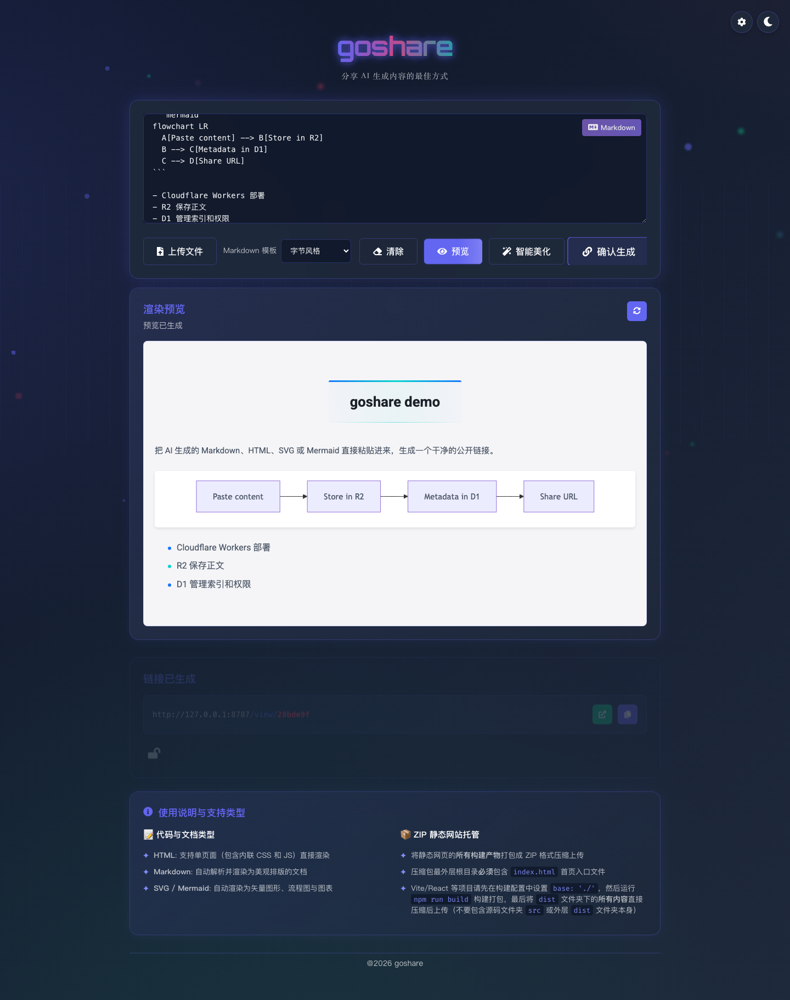
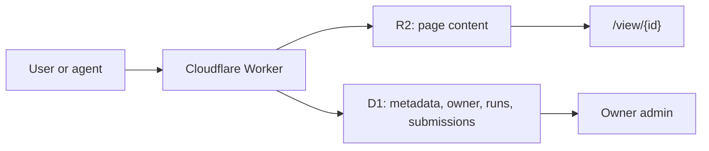

<p align="center">
  
</p>

<h1 align="center">goshare</h1>

<p align="center">
  <strong>把 AI 生成内容变成可拥有、可分享、可自动化的链接。</strong><br>
  Paste HTML, Markdown, SVG, Mermaid, or static ZIP output, then share it from your own Cloudflare stack.
</p>

<p align="center">
  <a href="#先复制-prompt-给-ai-部署"><strong>复制 Prompt 部署</strong></a>
  ·
  <a href="docs/AI_DEPLOY_GUIDE.md"><strong>保姆级部署指南</strong></a>
  ·
  <a href="#部署前你需要知道"><strong>部署前提</strong></a>
  ·
  <a href="#agent-api"><strong>Agent API</strong></a>
  ·
  <a href="#本地开发"><strong>本地开发</strong></a>
  ·
  <a href="#english"><strong>English</strong></a>
</p>

[](https://github.com/HaipingShi/goshare/stargazers)
[](https://github.com/HaipingShi/goshare/forks)
[](https://github.com/HaipingShi/goshare/issues)
[](#license)

## 先复制 Prompt 给 AI 部署

第一次部署不用先懂 Cloudflare。建议先复制下面这段给 Codex、Claude Code 或其他 AI coding agent，让它按仓库里的保姆级指南带你完成。

```text
你是我的 goshare Cloudflare 部署向导。目标：把 https://github.com/HaipingShi/goshare 部署到我的 Cloudflare 账号，并完成一次真实冒烟测试。

请先读取并严格使用这些文件，不要只凭记忆操作：
1. README.md：项目概览、变量说明、安全提示。
2. docs/AI_DEPLOY_GUIDE.md：每一步的引导、解释、排错和部署记录模板。
3. wrangler.jsonc：Worker、Static Assets、D1、R2、Workers AI 的绑定配置。
4. migrations/：需要应用到 Cloudflare D1 的数据库迁移。
5. package.json：可用脚本和 Wrangler 命令。

工作方式：
- 每一步先用一句话解释“这是什么、为什么要做、会创建什么资源或可能产生什么费用”，再给我命令或页面操作。
- 如果我没有 Cloudflare 账号，先用普通话解释 Cloudflare 是什么：它是运行 Worker、数据库 D1、文件存储 R2 和可选 Workers AI 的云平台；然后引导我注册和登录。
- 如果我没有域名，先使用 Cloudflare 默认的 *.workers.dev 地址。部署成功后必须提醒我记录完整访问地址，否则我可能部署完找不到站点。
- 如果我想用自定义域名，先说明这是可选项；引导我绑定域名，并记录最终域名。
- 如果 Deploy to Cloudflare 页面提示仓库名已存在，告诉我这只是 Git 仓库重名，不一定是 Cloudflare 已有重复项目；让我换一个项目/仓库名，例如 goshare-myname。
- 不要让我把 AUTH_PASSWORD、COOKIE_SECRET、AGENT_API_TOKEN 粘贴到聊天里；需要 secret 时，引导我在终端或 Cloudflare 控制台输入。
- 默认保持 AUTH_ENABLED=true。除非我明确要求公开创建入口，否则不要关闭登录保护。
- PUBLIC_SITE_URL 必须设置为最终访问地址：有自定义域名就填自定义域名；没有就填 workers.dev 地址。
- D1 的 database_id 如果是本地配置需要更新，只能改本地 wrangler.jsonc，不能把真实 database_id 提交到公开仓库。
- 任何删除、覆盖、重建 Cloudflare 资源的动作，都必须先单独征求我确认。

请按这个顺序执行：
1. 检查我是否已登录 Cloudflare，并解释没有账号时怎么办。
2. 优先使用 README 中的 Deploy to Cloudflare 按钮部署；如果按钮流程失败，再使用 Wrangler CLI 兜底。
3. 引导我设置生产 Secrets：AUTH_PASSWORD、COOKIE_SECRET、AGENT_API_TOKEN。
4. 确认 D1 migrations 已应用到远端数据库。
5. 部署 Worker，并记录 Worker 名称、workers.dev URL、自定义域名、D1 数据库、R2 bucket、Git 仓库 URL。
6. 做冒烟测试：登录页、首页创建 Markdown、/share/<id>、/view/<id>、/bootstrap、Agent API。
7. 最后输出一份部署记录和还没完成的可选项。
```

<p align="center">
  <a href="https://deploy.workers.cloudflare.com/?url=https://github.com/HaipingShi/goshare">
    
  </a>
</p>

更详细的逐步解释见 [docs/AI_DEPLOY_GUIDE.md](docs/AI_DEPLOY_GUIDE.md)。你可以把这份文件当作 AI Agent 的部署说明书。


## 这是什么

你让 AI 写了一个 HTML demo、一段 Markdown 文档、一个 SVG 图标、一个 Mermaid 图，或者一个静态网页 ZIP。

goshare 做一件事：把这些内容放进你自己的 Cloudflare R2/D1/Workers，生成一个适合转发的 `/share/<id>` H5 分享卡片，并保留正文页 `/view/<id>`。你拥有数据，也拥有部署。

## 为什么用

- **AI 输出立刻可交付**：不用让内容困在聊天窗口或本地文件里。
- **数据归你**：正文进 R2，索引、权限和提交数据进 D1。
- **人和 Agent 都能创建**：网页粘贴生成，或用 Bearer Token 调 Agent API。
- **转发更像 H5 卡片**：默认分享卡片页，标题摘要可读，正文从卡片进入。
- **Markdown 好看**：内置字节风格、GitHub、技术文档三种模板。
- **适合自部署传播**：Deploy Button、`/bootstrap` 和部署 prompt 都已准备好。

## 部署前你需要知道

Cloudflare 可以简单理解成一个把小应用部署到全球边缘节点的云平台。goshare 用到它的 4 个能力：

- **Workers**：运行这个分享站的后端和页面渲染。
- **R2**：保存你粘贴的 HTML、Markdown、SVG、Mermaid 或 ZIP 正文。
- **D1**：保存短链、权限、Agent run 和页面提交数据。
- **Workers AI**：可选，用于“智能美化”内容和生成分享卡片标题摘要。

准备条件：

- **Cloudflare 账号**：必须。没有账号也可以先点 Deploy Button，按 Cloudflare 引导注册。
- **GitHub 或 GitLab 账号**：建议准备。Deploy Button 会把项目复制到你的代码托管账号，再部署到你的 Cloudflare。
- **自定义域名**：可选。没有域名也能先用 Cloudflare 分配的 `*.workers.dev` 地址。
- **本地 Node.js / Wrangler**：可选。只有你想在本地开发或手动部署时才需要。
- **OpenAI API key**：不需要。本项目的 AI 美化走 Cloudflare Workers AI，不走 OpenAI。

费用归属：

- 点击 Deploy Button 后，Worker、R2、D1、Workers AI 都创建在**部署者自己的 Cloudflare 账号**里。
- Workers AI 用量也计入**部署者自己的 Cloudflare 账号**，不会消耗本仓库作者的 token 或额度。
- `AGENT_API_TOKEN` 只是你给 coding agent 调 goshare API 用的访问密码，不是 Cloudflare 计费 token。
- Cloudflare Workers AI 通常有免费额度；高于免费额度或开启付费计划后的用量，以 Cloudflare 当前价格为准。

## 一键部署

点击顶部 **Deploy to Cloudflare**，Cloudflare 会读取 `wrangler.jsonc` 并绑定：

- Worker：`src/worker.js`
- Static Assets：`public/`
- D1：`DB`
- R2：`CONTENT_BUCKET`
- Workers AI：`AI`

部署后建议立刻在 Cloudflare Worker 的 Variables/Secrets 设置：

```txt
AUTH_PASSWORD=<your-strong-password>
COOKIE_SECRET=<openssl rand -hex 32>
AGENT_API_TOKEN=<agent-api-token-for-coding-agents>
APP_LOGO_URL=/icon/web/icon-512.png
PUBLIC_SITE_URL=https://your-share-domain.example
AI_SHARE_METADATA_ENABLED=true
AI_SHARE_METADATA_MODEL=@cf/zai-org/glm-4.7-flash
MAX_SHARE_METADATA_CONTENT_KB=24
SECURITY_SCAN_ENABLED=true
DAILY_CREATE_LIMIT=50
DAILY_AGENT_CREATE_LIMIT=200
DAILY_AI_LIMIT=20
```

`AUTH_ENABLED` 在默认部署配置中已经是 `true`。如果你把它改成 `false`，首页、创建接口、预览和智能美化接口会公开给所有访问者，不建议在生产环境关闭。

`APP_FOOTER_TEXT` 和 `APP_FOOTER_URL` 是可选页脚配置，首次部署不需要填。部署完成后，如果你想在页面底部显示品牌、备案号或官网链接，再到 Worker Variables 手动新增即可。

## 安全提示

goshare 不会要求你的 Cloudflare API Token，也不会把 Worker Secrets 暴露给访问者；但它是一个可以发布 HTML/Markdown/SVG/Mermaid/ZIP 的自托管分享工具，上线前请按下面的方式收紧默认暴露面。

- **保持 `AUTH_ENABLED=true`**：这是生产默认值。关闭后，任何人都能访问首页并创建分享页，可能消耗你的 Workers、R2、D1 和 Workers AI 额度。
- **需要公开创建入口时保留防护栏**：如果你为了分享便利把 `AUTH_ENABLED=false`，请至少保持 `SECURITY_SCAN_ENABLED=true`，并设置 `DAILY_CREATE_LIMIT`、`DAILY_AGENT_CREATE_LIMIT`、`DAILY_AI_LIMIT`。
- **内容扫描不是杀毒引擎**：它会拦截明显的钓鱼、凭据采集、Cookie 外传、自动跳转和高混淆脚本，但不能保证识别所有恶意页面。
- **Secret 不要写进仓库**：`AUTH_PASSWORD`、`COOKIE_SECRET`、`AGENT_API_TOKEN` 必须在 Cloudflare Worker 的 Secrets 里设置。
- **使用强随机值**：`COOKIE_SECRET` 建议用 `openssl rand -hex 32`；`AGENT_API_TOKEN` 建议用密码管理器生成 32 位以上随机字符串。
- **使用独立子域名**：建议部署到 `share.example.com`，不要和你的主站、管理后台或业务系统共用同一个域名。
- **谨慎打开陌生 HTML/ZIP 分享页**：分享内容会在你的分享域名下渲染。陌生内容建议用无痕窗口查看，不要在后台已登录状态下打开。
- **5 位访问密码只适合临时分享**：不要把它当作强加密或长期保密方案。
- **Workers AI 会计入部署者账号用量**：不想产生 AI 调用时，把 `AI_ENABLED=false` 或 `AI_SHARE_METADATA_ENABLED=false`。

默认限额：

| 变量 | 默认值 | 说明 |
| --- | --- | --- |
| `SECURITY_SCAN_ENABLED` | `true` | 创建分享页前扫描高风险 HTML/ZIP/脚本模式 |
| `DAILY_CREATE_LIMIT` | `50` | 每个访问者每天通过网页创建的分享页数量 |
| `DAILY_AGENT_CREATE_LIMIT` | `200` | 每个 Agent Token 每天通过 Agent API 创建的分享页数量 |
| `DAILY_AI_LIMIT` | `20` | 每个访问者每天调用智能美化的次数 |

这些限制按 UTC 日期重置；把限制值设为 `0` 表示关闭对应限额。

## 功能一览

| 能力 | 说明 |
| --- | --- |
| HTML / Markdown / SVG / Mermaid | 自动识别并渲染成可分享页面 |
| 静态 ZIP | 上传构建产物，托管一个轻量静态站 |
| 访问密码 | 给单条分享开启 5 位数字密码 |
| H5 分享卡片 | 生成 `/share/<id>` 卡片页，转发时展示标题、摘要和打开入口 |
| 智能标题摘要 | 可选使用 Workers AI 生成分享卡片标题摘要，不可用时自动规则提取 |
| Owner 后台 | 当前浏览器只管理自己创建的页面 |
| 页面提交数据 | 分享页可用 `window.goshare.submit()` 写入 D1 |
| Agent API | coding agent 可直接创建分享页 |

<details>
<summary>查看更多截图</summary>




| 内容管理后台 | 访问密码 |
| --- | --- |
|  |  |

</details>

## Agent API

设置 `AGENT_API_TOKEN` 后，vibe coding agent 可以不经过 UI，直接创建分享页。

```bash
curl -X POST "https://your-share-domain.example/api/agent/pages" \
  -H "Authorization: Bearer $AGENT_API_TOKEN" \
  -H "Content-Type: application/json" \
  -d '{
    "content": "# Hello goshare\n\nCreated by an agent.",
    "codeType": "markdown",
    "markdownTheme": "github",
    "isProtected": false
  }'
```

成功响应包含：

```json
{
  "success": true,
  "url": "https://your-share-domain.example/share/abc1234",
  "cardUrl": "https://your-share-domain.example/share/abc1234",
  "viewUrl": "https://your-share-domain.example/view/abc1234",
  "urlId": "abc1234",
  "runId": "run_1234567890abcdef12",
  "status": "completed",
  "title": "Hello goshare",
  "summary": "Created by an agent.",
  "logs": []
}
```

<details>
<summary>OpenAPI 最小片段</summary>

```yaml
paths:
  /api/agent/pages:
    post:
      security:
        - bearerAuth: []
      requestBody:
        required: true
        content:
          application/json:
            schema:
              type: object
              properties:
                content:
                  type: string
                htmlContent:
                  type: string
                zipContent:
                  type: string
                codeType:
                  type: string
                  enum: [html, markdown, svg, mermaid, zip]
                markdownTheme:
                  type: string
                  enum: [bytedance, github, docs]
                isProtected:
                  type: boolean
                title:
                  type: string
                  description: Optional title override
                summary:
                  type: string
                  description: Optional summary override
      responses:
        "201":
          description: Page created
components:
  securitySchemes:
    bearerAuth:
      type: http
      scheme: bearer
```

</details>

## 本地开发

```bash
npm install
npm run db:migrate:local
npm run dev
```

验证 Worker 配置：

```bash
npm run check
```

刷新 README 截图：

```bash
npm run capture:screenshots
```

## 手动部署

Deploy Button 之外，也可以用 Wrangler 自己创建资源：

```bash
npx wrangler d1 create goshare-db
npx wrangler r2 bucket create goshare-content
npx wrangler secret put AUTH_PASSWORD
npx wrangler secret put COOKIE_SECRET
npx wrangler secret put AGENT_API_TOKEN
npm run deploy
```

自定义域名推荐在 Cloudflare 控制台的 **Workers & Pages -> goshare -> Settings -> Domains & Routes** 里绑定。

## 数据模型



核心表：

- `pages`：短链、R2 key、owner、密码、内容类型、Markdown 模板。
- `page_submissions`：分享页内提交的数据。
- `agent_runs` / `agent_run_logs`：Agent API 创建记录和日志。

## 可以改什么

- 换品牌：`APP_NAME`、`APP_DESCRIPTION`、`APP_LOGO_URL`、footer。
- 换模板：调整 `public/css/markdown-bytedance.css` 或 `public/css/markdown-themes/`。
- 加认证：把 owner cookie 换成 GitHub、Google、邮箱验证码或 Cloudflare Access。
- 加生命周期：给 `pages` 增加 `expires_at`。
- 加公开广场：基于 `/api/pages/list/recent` 展示最近分享。

## 常见问题

| 问题 | 处理 |
| --- | --- |
| D1 本地表不存在 | 运行 `npm run db:migrate:local` |
| 生产 Agent API 返回未配置 | 设置 `AGENT_API_TOKEN` secret |
| 首页不想公开 | 设置 `AUTH_ENABLED=true` 和 `AUTH_PASSWORD` |
| 创建返回 429 | 达到每日额度，调大 `DAILY_CREATE_LIMIT` / `DAILY_AGENT_CREATE_LIMIT` / `DAILY_AI_LIMIT` |
| 创建返回 422 | 内容安全扫描拦截了明显钓鱼、凭据采集、外部跳转或高风险脚本 |
| 清 Cookie 后后台看不到旧内容 | owner 身份保存在浏览器 cookie；旧分享链接仍可访问 |

## English

goshare turns AI-generated HTML, Markdown, SVG, Mermaid, and static ZIP output into shareable links on your own Cloudflare stack.

- Content is stored in R2; metadata, owners, submissions, and agent runs are stored in D1.
- Users can paste content in the UI; coding agents can create pages through `POST /api/agent/pages`.
- Deploy with the Cloudflare button above, then set `AUTH_PASSWORD`, `COOKIE_SECRET`, and `AGENT_API_TOKEN`.
- Run locally with `npm install`, `npm run db:migrate:local`, and `npm run dev`.

## 致谢

本项目基于 [joeseesun/quickshare-cloudflare](https://github.com/joeseesun/quickshare-cloudflare) 改造而来。感谢原作者开源 QuickShare Cloudflare。

Thanks to [Cloudflare Workers](https://workers.cloudflare.com/), [Cloudflare R2](https://developers.cloudflare.com/r2/), [Cloudflare D1](https://developers.cloudflare.com/d1/), [marked](https://github.com/markedjs/marked), and [Playwright](https://playwright.dev/).

## License

ISC
